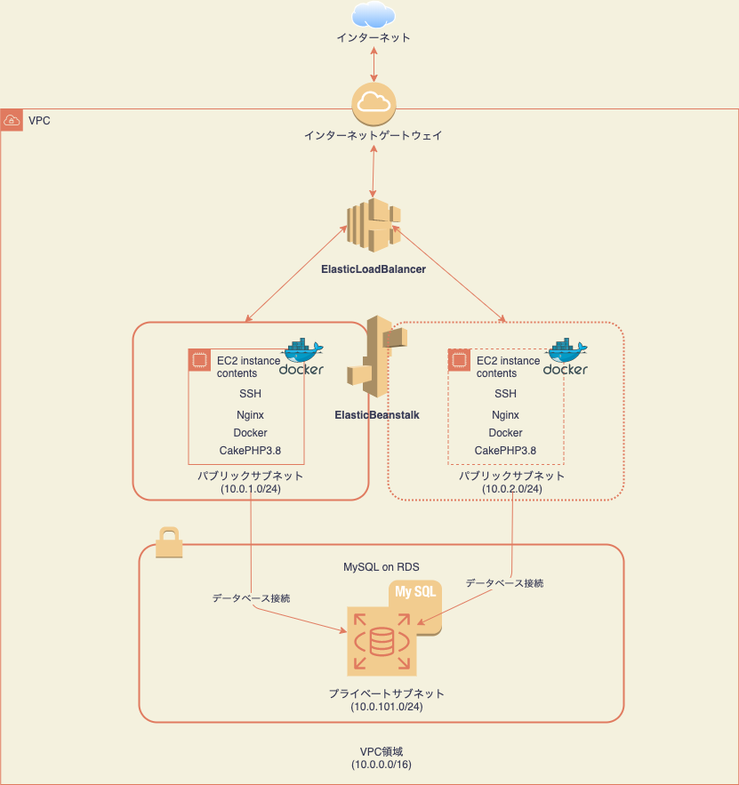

## QUELCINEMAS

### ABOUT
   オンライン映画予約サービスのデモサイトです。
   会員登録→上映映画選択→支払い情報登録（クレジットカード）→映画予約まで一連の操作が可能となっております。

### 使用技術
- HTML /CSS
- Javascript / jQuery / Ajax
- PHP7.3
- CakePHP3.8
- AWS(EC2,VPC,RDS,ElasticBeanstalk,Route53,AamazonCertificateManager,CodePipeline)
- Docker
- Docker-compose(ローカル開発環境用)
- Nginx
- MySQL8.0
- Git/GitHub

## 🌐 App URL

### https://quelcinemas.tk

## ⛏HOW TO USE
※ゲストログイン機能を近日中に実装する予定です。
#### ログイン→座席予約を行う場合
1.ヘッダーの「ログイン」でログインページに遷移し、「会員登録」画面で会員情報を入力します。

メールアドレスは「　****@****.***　」の形式で入力ください

2.ヘッダーの「ログイン」でログインページに遷移し、先ほど入力した情報でログインします。

3.ヘッダーの「上映スケジュール」ページから予約したい映画を選択します（この時、予約済みの映画を選択するとリダイレクトされます。マイページよりキャンセルを行なってからの再度予約が必要です）

4.座席選択→支払い情報入力→確認画面の流れで予約が完了します。確認したい場合は「マイページ」を参照してください。

※支払い情報は個人の番号ではなく、下記のテストカード番号をお使いください。

テストカード番号（参照：https://www.omise.co/ja/api-testing/japan）

正常系
| カード番号 | カードブランド |
| ------------- | ------------- |
| 4242 4242 4242 4242  | Visa  |
| 4111 1111 1111 1111  | Visa  |
| 5555 5555 5555 4444  | Mastercard  |
| 5454 5454 5454 5454  | Mastercard  |

異常系 (バリデーションが発生します)
| カード番号 | カードブランド |
| ------------- | ------------- |
| 4111 1111 1114 0011  | Visa  |
| 5555 5511 1111 0011  | Mastercard  |

#### ログインを行わない場合
- 映画スケジュール
- 料金表
- トップページ

はログインせずとも閲覧可能となっております。

## 🛠feature
- 仮予約機能：座席を予約し、かつ決済情報が未入力の状態が15分経過した場合は、その予約は削除される機能を実装しております。
- 座席選択後のキャンセル機能：座席選択後の確認画面で「キャンセル」ボタンを押した場合は、仮予約はされずに座席選択画面で先ほど選択した座席を選択済み状態遷移するよう実装しています。
- 可用性を実現するために負荷が増えた際にはEC2インスタンスが自動的に増設されるように実装しております。(AutoScalling）

## 🌐Network

## Other
本開発は3人でのチーム開発で行いました。チーム開発ではレビューの精度を高めるために話し合いを行なっておりました。
いくつか私がプルリクを提出したものと、レビューしたもののリンクを添付します。
- プルリク

https://github.com/labotinc/quelcode-team4-2/pull/25

https://github.com/labotinc/quelcode-team4-2/pull/36
- レビュー

https://github.com/labotinc/quelcode-team4-2/pull/46

https://github.com/labotinc/quelcode-team4-2/pull/52
